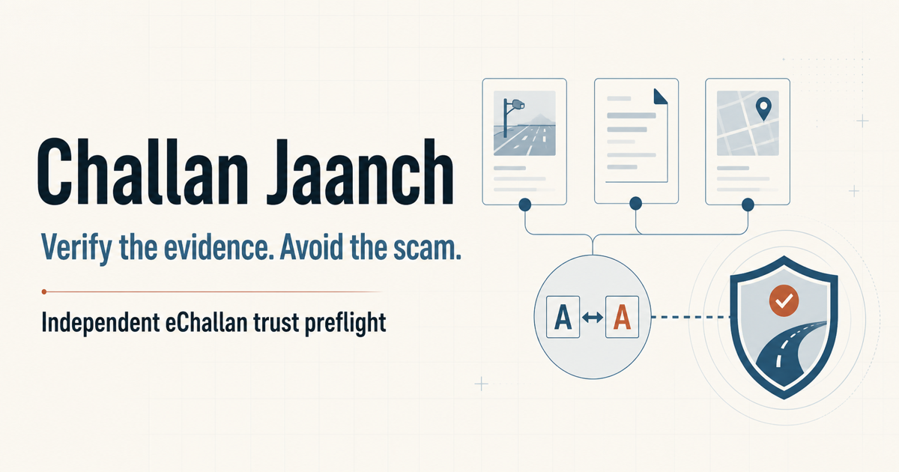

# Challan Jaanch



An evidence-first preflight for potentially incorrect or fraudulent Indian eChallans. It combines a source-linked contradiction checker with a local Scam Shield for suspicious messages, APK lures, credential requests, and lookalike payment destinations.

- **Live public demo:** https://challan-jaanch.deftsalt.chatgpt.site
- **Hackathon submission pack:** [SUBMISSION.md](SUBMISSION.md)

## What makes it different

- **Source-linked findings:** every claim points back to the exact confirmed fields that produced it.
- **A real refusal path:** ambiguous plate characters or unreadable vehicle classes stop the finding instead of becoming an allegation.
- **Model/code separation:** optional multimodal AI extracts observable fields; deterministic TypeScript rules choose the outcome.
- **Human verification gates:** editing a decisive field invalidates its confirmation and the prior result.
- **Portable evidence packet:** supported claims can be downloaded as a citizen-prepared PDF plus a machine-readable JSON manifest.
- **Scam Shield:** pasted messages and URLs are inspected locally with deterministic rules; suspicious destinations remain inert and are never opened.
- **Incident-aware routing:** attempted impersonation routes to I4C Report Suspect, while payments, credential exposure, or APK installation route to 1930 and the National Cyber Crime Reporting Portal.
- **No government impersonation:** the app never asks for portal credentials, submits a grievance, or claims a government decision.

## Guided experience

1. Run one of three visibly synthetic cases or select your own records.
2. Inspect the sources in the evidence workbench.
3. Compare plate characters and review the Rule 167 clock.
4. Confirm each decisive fact against the source.
5. Run the deterministic comparison.
6. Inspect the finding map and adversarial counter-checks.
7. Build a redacted or official-handoff packet.
8. Continue separately on the official eChallan portal.

The synthetic evidence demo and Scam Shield are complete without an API key. Live file extraction is optional and fails safely into manual verification when it is not configured.

## Technology

| Layer | Choice | Role |
| --- | --- | --- |
| Interface | React 19, TypeScript, Tailwind CSS 4 | Responsive state-machine journey and accessible interactions |
| App framework | Vinext, Vite 8, Next-compatible routing | Fast development and Cloudflare Worker output |
| Extraction | OpenAI Responses API, optional | Structured multimodal field extraction with `store: false` |
| Decision layer | Deterministic TypeScript | Plate, vehicle-family, duplicate-event, and deadline rules |
| Scam triage | Deterministic TypeScript | Exact-host allowlisting, inert URL parsing, advisory-pattern detection, and exposure routing |
| Exports | jsPDF and browser Web APIs | Client-side PDF, JSON manifest, SHA-256 hashes, audio guidance |
| Hosting | OpenAI Sites | Versioned deployment; public access is a separate release decision |
| Persistence | None by design | No application database, analytics, or persistent document store |

The production artifact also carries restrictive framing, referrer, MIME-sniffing, browser-permission, and opener-isolation headers.

## Run locally

Requirements: Node.js 22.13 or newer and npm.

```bash
npm install
npm run dev
```

Open `http://localhost:3000`.

For optional live extraction:

```bash
cp .env.example .env.local
```

Add `OPENAI_API_KEY` to `.env.local`. Never commit that file. The demo does not need it.

## Verify before pushing

```bash
npm run verify
```

This runs linting, TypeScript checks, deterministic-rule tests, and the production build.

For the full release gate, including the npm production-dependency advisory check:

```bash
npm run release:check
```

## Repository map

```text
app/page.tsx                       Citizen journey and state machine
app/api/analyze/route.ts           Optional structured extraction endpoint
components/EvidenceWorkbench.tsx  Source inspector, character diff, rule clock
components/ProductGuide.tsx       Audio guide and in-product architecture drawer
components/ScamShield.tsx         Local scam triage, recovery plan, and official routing
lib/cases.ts                       Typed fixtures, comparison rules, date logic
lib/scam-shield.ts                 Pure scam signals, URL classification, and response tracks
tests/rules.test.mjs               Deterministic rule and API-boundary tests
docs/ARCHITECTURE.md               Trust boundaries and data flow
docs/LOCAL_DEVELOPMENT.md          Setup and troubleshooting
docs/DEMO_SCRIPT.md                Timed two-minute submission walkthrough
docs/VIDEO_NARRATION.txt           Clean voice-over copy for the submission video
```

## Product boundary

Challan Jaanch reports conflicts visible in supplied records and risk patterns in pasted communications. It does not declare a challan invalid, authenticate a sender, certify a message as safe, infer fraud or cloning, predict grievance success, provide legal advice, or perform an official submission. The Rule 167 and cyber-advisory source packs are dated and must be rechecked before production use.

See [docs/ARCHITECTURE.md](docs/ARCHITECTURE.md) for the complete design.

For a full, explanatory walkthrough of every stage, program, data boundary, rule, deployment mode, and the no-database decision, read [SYSTEM_GUIDE.md](SYSTEM_GUIDE.md).
