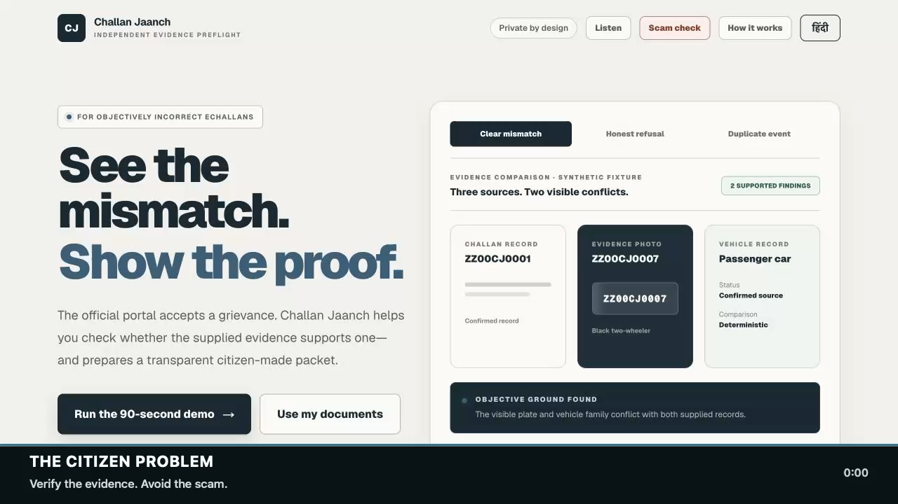

# Video deliverable

Recording provenance: this cut uses the 28 August 2026 interface. The September review removed the bulk-confirm button and simulated processing; the current app requires individual field review and explicit source clarity. The recorded technical test count was 36; the current suite has 39 tests. The existing video is retained as the original submission artifact.

`challan-jaanch-submission.mp4` is a 1 minute 47.5 second, 1920×1080 H.264 silent submission cut built entirely from the public synthetic demo. It contains no real challan, vehicle registration, phone number, login or personal upload.

The first minute follows the citizen journey: source review, decisive plate mismatch, human confirmation, narrow result, packet exports and Scam Shield. The second minute explains the React/TypeScript architecture, deterministic decision layer, honest-refusal path, coding standards and no-database privacy model. Burned-in captions carry the complete explanation; there is no audio track.

The timed editorial companion is [`../docs/DEMO_SCRIPT.md`](../docs/DEMO_SCRIPT.md). The production source is [`../submission/video-production/compose_silent_demo.swift`](../submission/video-production/compose_silent_demo.swift), with verified product captures in [`../submission/video-assets/`](../submission/video-assets/).

The caption phrase “storage disabled” refers specifically to `store: false`, which disables retrievable response storage. It does not claim zero provider retention; OpenAI API data controls may still apply. The public submission deployment has no API key, so its reviewer journey never transmits a document to OpenAI.
